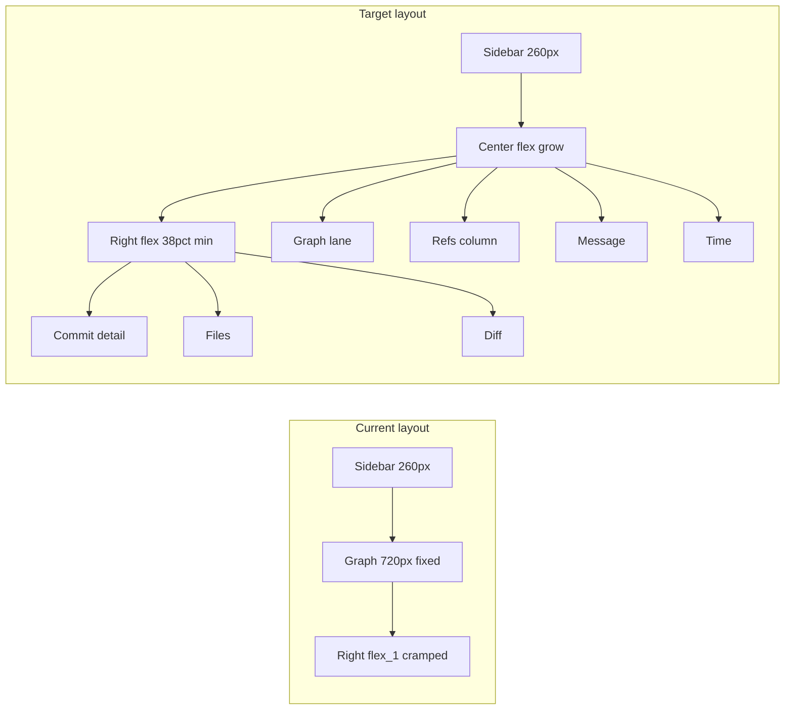

# GitKraken-style layout rework (Zed aesthetic)

## Current state vs target

GitForge already has the right **mental model** (sidebar | graph+history | right pane) composed in [`crates/gitforge-app/src/views/app.rs`](crates/gitforge-app/src/views/app.rs), but proportions and information hierarchy do not match the reference:

| Issue                | Today                                                                                                  | GitKraken reference                                               |
| -------------------- | ------------------------------------------------------------------------------------------------------ | ----------------------------------------------------------------- |
| Center width         | **Fixed `720px`** in [`graph_panel.rs`](crates/gitforge-app/src/views/graph_panel.rs) (lines 185, 515) | Flexible center column (~45–55% of window)                        |
| Right pane space     | ~300px left on 1280px window after 260+720                                                             | ~35–40% for commit detail + diff                                  |
| Center columns       | Single row: graph + hash + message + ref pills + author/time                                           | Distinct columns: **refs \| graph \| message \| time**            |
| Right pane structure | Commit header + **horizontal** file list (220px) + diff                                                | Commit detail block on top; files + diff below with room for diff |
| Chrome               | 17+ text buttons in [`toolbar.rs`](crates/gitforge-app/src/views/toolbar.rs); remote status inline     | Slim toolbar + **bottom status bar**                              |
| Metadata             | Duplicated (author/time in graph rows **and** diff header)                                             | Rich detail on right; center rows stay scannable                  |



**Your choices:** keep graph visible in Changes mode; draggable splits later.

---

## Screenshot calibration (current GitForge — May 31)

Reference capture: `assets/image-9608eb22-59fa-4b3a-8aea-abe0af12639a.png` (Hub repo, `arch/unified-authorization-scoping`).

### What the screenshot confirms

| Observation                                                                                           | Impact on plan                                                                                                                      |
| ----------------------------------------------------------------------------------------------------- | ----------------------------------------------------------------------------------------------------------------------------------- |
| **Center reads as a flat list** — SHA, message, HEAD pill, author, time; no obvious lane/graph column | Prioritize **column headers** and dedicated **GRAPH** column; audit canvas contrast so lanes/nodes read on `#0d1117` background     |
| **Right pane is a narrow empty strip** — only gray **"DIFF"** label, no commit detail or file list    | **Highest priority:** flex rebalance so right pane is ~35–40% width; add **empty state** ("Select a commit…") when nothing selected |
| **Toolbar is 12+ text buttons in one row**                                                            | Toolbar slim-down is **P0**, not polish — move Clone/GitHub/GitLab/SSH to **More** menu                                             |
| **Sidebar is functional but dense** — `F` / `co` / `M` / `R` / `x` on every branch                    | **Out of scope** for this pass unless you ask; optional later: context menu instead of inline letters                               |
| **Breadcrumb is path-only** — `GitForge /home/jason/Dev/Hub`                                          | Change to **`Hub › arch/unified-authorization-scoping`** (repo folder name + current branch from `RepoState`)                       |
| **No bottom status bar**                                                                              | Add 24px status bar as planned                                                                                                      |
| **Teal-on-black matches theme**                                                                       | Keep `default-dark.json` tokens; adjust hierarchy via `surface` steps, not a new palette                                            |

### Calibrated layout constants (from screenshot)

These replace the tentative values in section 1:

- `CENTER_FLEX = 3`, `RIGHT_FLEX = 2` on the content row (center still gets graph+list, but right is no longer starved)
- `CENTER_MAX_FRACTION = 0.55` — cap center growth so right never collapses below ~320px on 1280px windows
- `RIGHT_MIN_WIDTH = 360` (was 320) — enough for file list + diff side-by-side
- `FILE_LIST_WIDTH = 240` — slightly narrower than 260 so diff gets more room at 1280px
- Default window: **1440×900** in [`main.rs`](crates/gitforge-app/src/main.rs) (was 1280×800)

At **1280px** width: sidebar 260 + right min 360 → center ~660 max (down from fixed 720), right always usable.

### Graph visibility note

Code places a **140px canvas** before the SHA in each row ([`graph_panel.rs`](crates/gitforge-app/src/views/graph_panel.rs)). The screenshot may show SHA flush-left because per-row lane segments are subtle on a linear history, or painting is hard to see. This pass will:

1. Add a labeled **GRAPH** column in the header row (aligns columns visually).
2. Slightly increase lane stroke alpha for continuing lines (e.g. 0.4 → 0.55).
3. Manually verify on Hub after layout change.

---

## Target layout (History mode)

```
┌──────────────────────────────────────────────────────────────────┐
│ Toolbar: repo breadcrumb | History/Changes | core git actions    │
├──────────┬───────────────────────────────────┬───────────────────┤
│ Sidebar  │ COMMIT HISTORY (column headers)   │ Commit detail     │
│ 260px    │ REFS | GRAPH | MESSAGE | TIME     │ (title, author,   │
│          │ [scrollable virtual list]         │  sha, actions)    │
│          │                                   ├─────────┬─────────┤
│          │                                   │ Files   │ Diff    │
│          │                                   │ ~260px  │ flex_1  │
├──────────┴───────────────────────────────────┴─────────┴─────────┤
│ Status bar: remote op text | shortcut hints | app info           │
└──────────────────────────────────────────────────────────────────┘
```

**Changes mode:** same outer grid; center stays [`graph_panel`](crates/gitforge-app/src/views/graph_panel.rs); right stays [`status_panel`](crates/gitforge-app/src/views/status_panel.rs) but uses the same flex contract and file-list width as History so tabs do not feel like a different app.

---

## Implementation plan

### 1. Centralize layout constants

Add a small module, e.g. [`crates/gitforge-app/src/views/layout.rs`](crates/gitforge-app/src/views/layout.rs) (or `gitforge-ui/src/layout.rs`):

- `SIDEBAR_WIDTH = 260`
- `CENTER_MIN_WIDTH = 480` (graph + message readable)
- `RIGHT_MIN_WIDTH = 320`
- `CENTER_FLEX = 3`, `RIGHT_FLEX = 2`, `RIGHT_MIN_WIDTH = 360`, `CENTER_MAX_FRACTION = 0.55`
- `GRAPH_LANE_WIDTH = 140` (existing `GRAPH_COL_WIDTH`)
- `REF_COL_MIN = 100`, `HASH_COL = 60`, `TIME_COL = 90`
- `FILE_LIST_WIDTH = 240` (calibrated for 1280px windows)
- `TOOLBAR_HEIGHT = 40`, `STATUS_BAR_HEIGHT = 24`

Optional: add matching keys to [`assets/themes/default-dark.json`](assets/themes/default-dark.json) later; constants are enough for this pass.

### 2. Shell changes — [`app.rs`](crates/gitforge-app/src/views/app.rs)

- Wrap main content in a column: `toolbar` → `content_row` → **`status_bar`** (new `render_status_bar()`).
- **Content row flex weights:**
  - Sidebar: fixed width (unchanged).
  - Center (`graph_area`): `flex_grow` with `min_w(CENTER_MIN_WIDTH)` — **remove reliance on 720px**.
  - Right panel: `flex_grow(2)` with `min_w(RIGHT_MIN_WIDTH)`; center `flex_grow(3)` with `max_w` cap — **fixes the empty DIFF sliver in the screenshot**.
- Move `remote_status` from toolbar into status bar (left); keep error banner above shell if present.
- Default window in [`main.rs`](crates/gitforge-app/src/main.rs): **1440×900** (calibrated).

### 3. Center panel — [`graph_panel.rs`](crates/gitforge-app/src/views/graph_panel.rs)

**Width:** Replace `.w(px(720.0))` with `.flex_1().min_w(px(CENTER_MIN_WIDTH)).h_full()` on the outer container.

**Column header row** (below existing "COMMIT HISTORY" header):

| REFS / TAGS | GRAPH | COMMIT MESSAGE | (spacer) | TIME |
| ----------- | ----- | -------------- | -------- | ---- |

Use `text_xs`, `text_muted`, `border_b_1` — Zed-style section labels.

**Row layout refactor** (per commit row, ~28px height unchanged):

1. **Refs column** (`min_w(REF_COL_MIN)`, `flex_shrink_0`): ref pills only (move out of trailing inline chips).
2. **Graph column** (`GRAPH_COL_WIDTH`): existing canvas (unchanged rendering logic).
3. **Hash column** (`60px`, monospace, accent): short SHA.
4. **Message column** (`flex_1`, ellipsis): summary only.
5. **Time column** (`TIME_COL`, right-aligned, muted): relative time only — **drop author name from row** (lives in right pane).

Selection styling: full-row highlight using `surface_high` / `sidebar_selected` token (already in theme) across all columns, matching GitKraken’s blue row selection.

Uncommitted row: same column grid; refs column empty; message "Uncommitted Changes".

### 4. Right panel — [`diff_panel.rs`](crates/gitforge-app/src/views/diff_panel.rs)

Restructure `DiffPanel::render` from:

```
header "DIFF" → commit_header → [file_list 220px | diff]
```

To:

```
commit_detail (flex_shrink_0) — title, full message body (if available), author + date, sha, cherry-pick/revert
→ divider
→ [file_list FILE_LIST_WIDTH | diff flex_1]  (horizontal, only when files exist)
```

Changes:

- Remove redundant **"DIFF"** section header or replace with subtle commit hash line in detail block (GitKraken-style).
- Enrich **commit detail**: use `commit.message` body when present (not only `summary`); optional placeholder for avatar circle (initials) using accent border — no image fetch required.
- Outer container: `.flex_1().min_w(px(RIGHT_MIN_WIDTH)).h_full()` so it participates in flex layout.
- File list: Path/Tree toggle can be **deferred** (stub two text buttons, Tree = flat list for now) unless trivial.

**Empty state (screenshot):** When no commit is selected, replace the blank right pane with a centered muted message and optional keyboard hint (`↑`/`↓` to browse commits). Still use full `RIGHT_MIN_WIDTH`.

### 5. Toolbar slim-down — [`toolbar.rs`](crates/gitforge-app/src/views/toolbar.rs)

**Keep visible:** GitForge label, breadcrumb **`Hub › branch-name`** (not full filesystem path — matches screenshot feedback), History/Changes tabs, Fetch/Pull/Push/Branch/Stash/Pop.

**Move to overflow / dialogs (not removed, just hidden from bar):** Clone, GitHub, GitLab, SSH, Accounts, AI-related buttons — group under a single **"More"** or **"..."** menu button opening existing dialogs.

**Remove from toolbar:** `remote_status` string (→ status bar).

Styling: slightly tighter `gap_2`, icon buttons later via [`crates/gitforge-ui/src/icon.rs`](crates/gitforge-ui/src/icon.rs) (optional polish pass).

### 6. Status panel alignment — [`status_panel.rs`](crates/gitforge-app/src/views/status_panel.rs)

- Outer panel: same `.flex_1().min_w(RIGHT_MIN_WIDTH)` as diff panel.
- Align `STATUS_FILE_WIDTH` (300) → `FILE_LIST_WIDTH` (260) for consistency, or keep 300 if screenshot shows Changes needs more file list width.
- Match header typography (`text_xs`, muted section label) to diff/commit detail pane.

### 7. Zed polish (theme-only, no new dependencies)

Apply across touched panels:

- Panel separation via **background steps** (`background` / `surface` / `surface_high`) rather than heavy borders; keep `border_b_1` at `colors.border` (#30363d).
- Row hover: `sidebar_hover` token.
- Typography: use theme `fonts.ui` where GPUI allows (today mostly hardcoded sizes — adopt `text_sm` / `text_xs` hierarchy consistently).
- Scroll areas: ensure `overflow_hidden` on center list container (already present) so graph does not clip awkwardly.

### 8. Deferred follow-ups (out of scope unless you ask)

- Draggable splitters (`gitforge-ui/src/components/*` stubs).
- Icon-first toolbar using `IconBank`.
- PR list in sidebar (GitKraken section).
- Workspace tabs + breadcrumb across repos.

---

## Files to touch (primary)

| File                                                               | Change                                       |
| ------------------------------------------------------------------ | -------------------------------------------- |
| [`app.rs`](crates/gitforge-app/src/views/app.rs)                   | Flex shell, status bar, panel weights        |
| [`graph_panel.rs`](crates/gitforge-app/src/views/graph_panel.rs)   | Column layout, remove 720px fixed width      |
| [`diff_panel.rs`](crates/gitforge-app/src/views/diff_panel.rs)     | Commit detail + file/diff split              |
| [`toolbar.rs`](crates/gitforge-app/src/views/toolbar.rs)           | Slim chrome, move secondary actions          |
| [`status_panel.rs`](crates/gitforge-app/src/views/status_panel.rs) | Match right-pane contract                    |
| New `layout.rs`                                                    | Shared constants                             |
| [`main.rs`](crates/gitforge-app/src/main.rs)                       | Default window 1440×900                      |
| [`sidebar.rs`](crates/gitforge-app/src/views/sidebar.rs)           | No change this pass (dense actions deferred) |

---

## Verification

Manual checks on a real repo (electron-sized history if available):

1. At 1280×800 and 1400×900: center grows/shrinks; right pane shows readable diff (not ~80px wide).
2. Select commit: row highlight spans all columns; detail appears only on right.
3. History ↔ Changes: graph remains visible; right pane width stable.
4. Long branch names: ref column truncates/ellipsis without crushing graph.
5. Remote fetch/pull: status text appears in bottom bar, not toolbar wrap.

No automated UI tests exist yet; visual regression is screenshot-driven.
